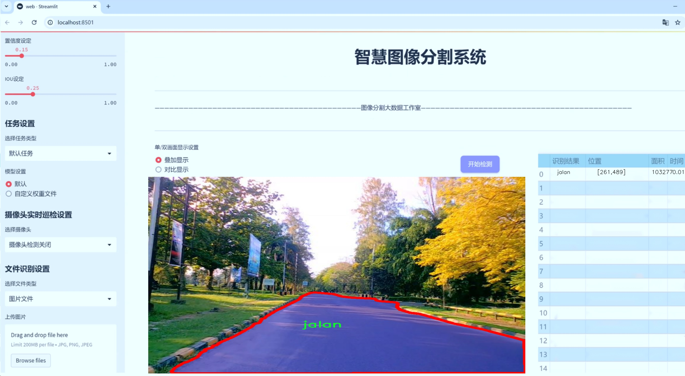
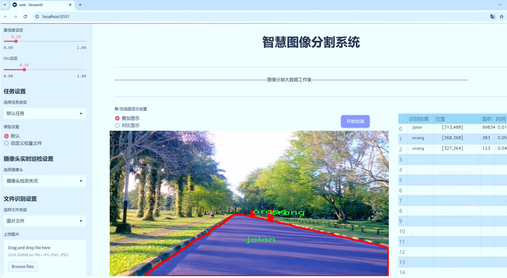
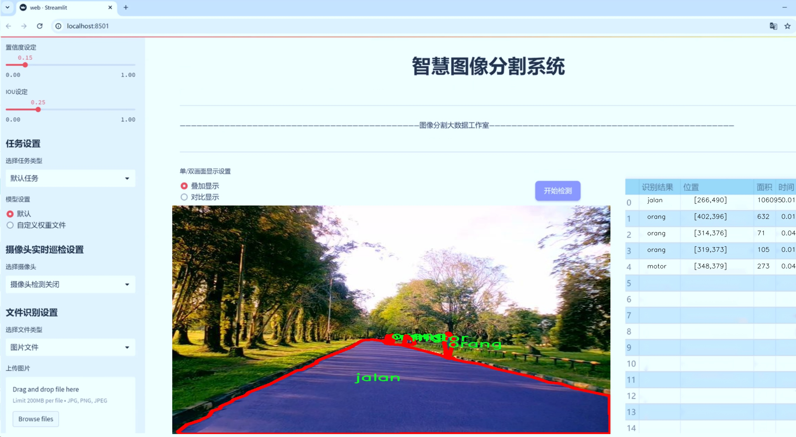
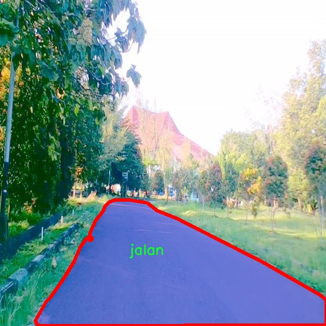
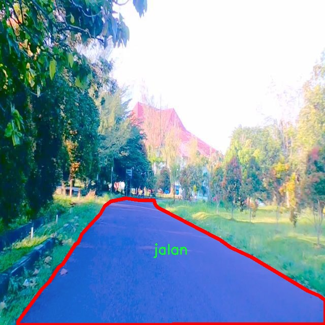
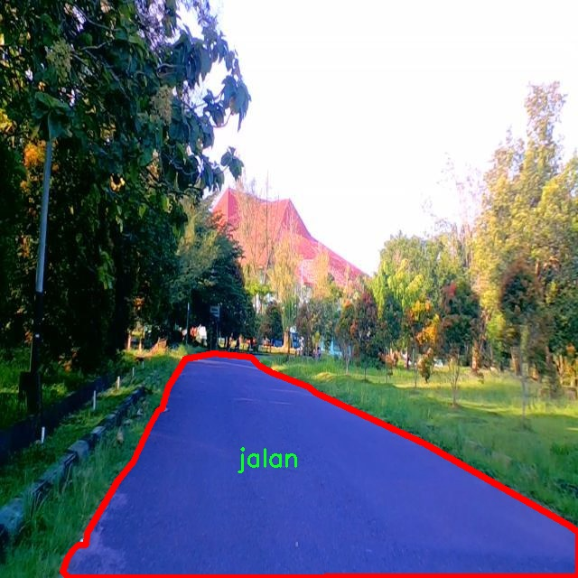
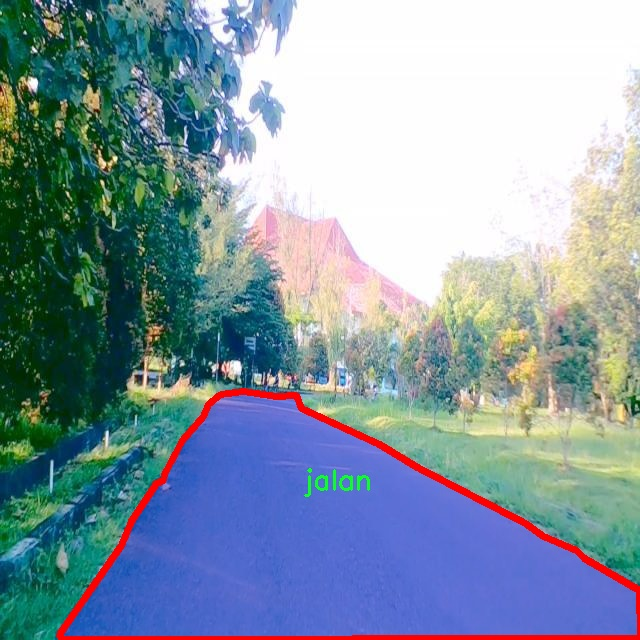
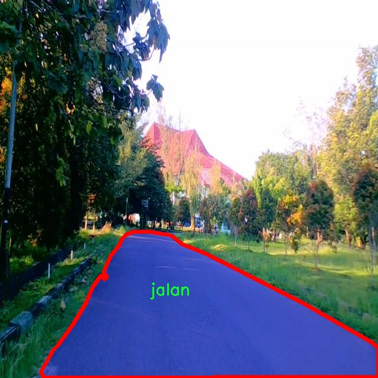

# 城市交通场景分割系统源码＆数据集分享
 [yolov8-seg-GFPN＆yolov8-seg-C2f-FocusedLinearAttention等50+全套改进创新点发刊_一键训练教程_Web前端展示]

### 1.研究背景与意义

项目参考[ILSVRC ImageNet Large Scale Visual Recognition Challenge](https://gitee.com/YOLOv8_YOLOv11_Segmentation_Studio/projects)

项目来源[AAAI Global Al lnnovation Contest](https://kdocs.cn/l/cszuIiCKVNis)

研究背景与意义

随着城市化进程的加快，城市交通问题日益突出，交通拥堵、事故频发以及环境污染等问题对城市的可持续发展构成了严峻挑战。为了有效管理和优化城市交通，交通场景的智能分析与处理显得尤为重要。近年来，计算机视觉技术的快速发展为交通场景的分析提供了新的思路和方法。尤其是基于深度学习的目标检测与分割技术，已经在多个领域取得了显著的成果。其中，YOLO（You Only Look Once）系列模型因其高效的实时性和准确性，成为了交通场景分析中的重要工具。

YOLOv8作为YOLO系列的最新版本，具备了更强的特征提取能力和更高的检测精度，能够在复杂的城市交通环境中进行有效的目标检测与分割。然而，尽管YOLOv8在多种场景下表现出色，但在特定的城市交通场景中，仍然存在一些不足之处。例如，传统的YOLOv8模型在处理密集交通、遮挡物以及多类目标时，可能会出现检测精度下降和误检的情况。因此，针对城市交通场景的特点，对YOLOv8进行改进，提升其在实例分割任务中的表现，具有重要的研究意义。

本研究将基于改进的YOLOv8模型，构建一个城市交通场景分割系统。该系统将利用包含9600张图像的多类别数据集进行训练和测试，数据集中涵盖了五个主要类别：道路（jalan）、汽车（mobil）、摩托车（motor）、行人（orang）和路障（roadblock）。这些类别的多样性为模型的训练提供了丰富的样本，能够有效提升模型在实际应用中的泛化能力和鲁棒性。通过对这些类别的精准分割与识别，研究将为城市交通管理提供更为细致和全面的数据支持，进而推动智能交通系统的发展。

此外，改进YOLOv8的城市交通场景分割系统不仅在学术研究上具有重要意义，也为实际应用提供了可行的解决方案。随着智能交通技术的不断进步，城市交通管理者可以利用该系统实时监测交通状况，识别交通参与者及障碍物，及时作出响应，优化交通流量，减少交通事故的发生。同时，该系统还可以为城市规划提供数据支持，帮助决策者制定更加科学合理的交通政策，提升城市交通的整体效率。

综上所述，基于改进YOLOv8的城市交通场景分割系统的研究，不仅具有重要的理论价值，还具备广泛的应用前景。通过深入探讨和解决当前城市交通场景分析中的关键问题，本研究将为智能交通领域的发展贡献新的思路和方法，推动城市交通管理的智能化进程。

### 2.图片演示







##### 注意：由于此博客编辑较早，上面“2.图片演示”和“3.视频演示”展示的系统图片或者视频可能为老版本，新版本在老版本的基础上升级如下：（实际效果以升级的新版本为准）

  （1）适配了YOLOV8的“目标检测”模型和“实例分割”模型，通过加载相应的权重（.pt）文件即可自适应加载模型。

  （2）支持“图片识别”、“视频识别”、“摄像头实时识别”三种识别模式。

  （3）支持“图片识别”、“视频识别”、“摄像头实时识别”三种识别结果保存导出，解决手动导出（容易卡顿出现爆内存）存在的问题，识别完自动保存结果并导出到tempDir中。

  （4）支持Web前端系统中的标题、背景图等自定义修改，后面提供修改教程。

  另外本项目提供训练的数据集和训练教程,暂不提供权重文件（best.pt）,需要您按照教程进行训练后实现图片演示和Web前端界面演示的效果。

### 3.视频演示

[3.1 视频演示](https://www.bilibili.com/video/BV1CQmKYEEHn/)

### 4.数据集信息展示

##### 4.1 本项目数据集详细数据（类别数＆类别名）

nc: 5
names: ['jalan', 'mobil', 'motor', 'orang', 'roadblock']


##### 4.2 本项目数据集信息介绍

数据集信息展示

在现代城市交通管理和智能交通系统的研究中，图像分割技术扮演着至关重要的角色。为了有效地训练和改进YOLOv8-seg模型，以实现对城市交通场景的精确分割，我们使用了名为“datamining”的数据集。该数据集专门设计用于捕捉和分析城市交通环境中的多种元素，提供了丰富的标注信息，助力模型在实际应用中的表现。

“datamining”数据集包含五个主要类别，分别是“jalan”（道路）、“mobil”（汽车）、“motor”（摩托车）、“orang”（行人）和“roadblock”（障碍物）。这些类别涵盖了城市交通场景中最常见的元素，能够帮助模型识别和分割不同的交通对象，从而提高交通监控和管理的智能化水平。

首先，数据集中“jalan”类别的图像提供了各种类型的道路场景，包括城市街道、高速公路和小巷等。这些图像不仅展示了不同的道路结构，还考虑了不同的天气条件和光照变化，确保模型在多样化环境下的鲁棒性。通过对道路的精确分割，模型能够更好地理解交通流动的模式，从而为交通管理提供有价值的数据支持。

其次，“mobil”类别的图像涵盖了多种类型的汽车，包括轿车、SUV、货车等。这些图像的多样性使得模型能够学习到不同车型的特征，增强其对车辆的识别能力。在城市交通场景中，车辆的动态行为对交通流的影响显著，因此准确分割车辆对于理解交通流量和优化交通信号控制至关重要。

“motor”类别则专注于摩托车的分割，考虑到摩托车在城市交通中的独特性和灵活性。该类别的图像展示了摩托车在不同交通条件下的表现，帮助模型识别摩托车在复杂场景中的运动轨迹和位置，从而提升交通安全性。

“orang”类别的图像专注于行人的分割，行人作为城市交通的重要组成部分，其行为模式和移动路径对交通安全有着直接影响。通过对行人的准确识别和分割，模型能够更好地预测行人的行为，进而为交通管理系统提供实时的安全预警。

最后，“roadblock”类别的图像展示了各种可能的障碍物，包括施工标志、事故车辆和其他临时障碍。这一类别的准确分割对于交通流的顺畅性和安全性至关重要，能够帮助交通管理系统及时识别和处理潜在的交通风险。

综上所述，“datamining”数据集为改进YOLOv8-seg的城市交通场景分割系统提供了丰富的训练数据。通过对五个类别的精确标注和多样化的场景设置，该数据集不仅提升了模型的识别能力，也为城市交通管理的智能化发展奠定了坚实的基础。随着数据集的不断扩展和优化，未来的交通系统将能够更加智能地应对复杂的城市交通挑战，推动智慧城市的建设进程。











### 5.全套项目环境部署视频教程（零基础手把手教学）

[5.1 环境部署教程链接（零基础手把手教学）](https://www.bilibili.com/video/BV1jG4Ve4E9t/?vd_source=bc9aec86d164b67a7004b996143742dc)


[5.2 安装Python虚拟环境创建和依赖库安装视频教程链接（零基础手把手教学）](https://www.bilibili.com/video/BV1nA4VeYEze/?vd_source=bc9aec86d164b67a7004b996143742dc)

### 6.手把手YOLOV8-seg训练视频教程（零基础小白有手就能学会）

[6.1 手把手YOLOV8-seg训练视频教程（零基础小白有手就能学会）](https://www.bilibili.com/video/BV1cA4VeYETe/?vd_source=bc9aec86d164b67a7004b996143742dc)


按照上面的训练视频教程链接加载项目提供的数据集，运行train.py即可开始训练



     Epoch   gpu_mem       box       obj       cls    labels  img_size
     1/200     0G   0.01576   0.01955  0.007536        22      1280: 100%|██████████| 849/849 [14:42<00:00,  1.04s/it]
               Class     Images     Labels          P          R     mAP@.5 mAP@.5:.95: 100%|██████████| 213/213 [01:14<00:00,  2.87it/s]
                 all       3395      17314      0.994      0.957      0.0957      0.0843

     Epoch   gpu_mem       box       obj       cls    labels  img_size
     2/200     0G   0.01578   0.01923  0.007006        22      1280: 100%|██████████| 849/849 [14:44<00:00,  1.04s/it]
               Class     Images     Labels          P          R     mAP@.5 mAP@.5:.95: 100%|██████████| 213/213 [01:12<00:00,  2.95it/s]
                 all       3395      17314      0.996      0.956      0.0957      0.0845

     Epoch   gpu_mem       box       obj       cls    labels  img_size
     3/200     0G   0.01561    0.0191  0.006895        27      1280: 100%|██████████| 849/849 [10:56<00:00,  1.29it/s]
               Class     Images     Labels          P          R     mAP@.5 mAP@.5:.95: 100%|███████   | 187/213 [00:52<00:00,  4.04it/s]
                 all       3395      17314      0.996      0.957      0.0957      0.0845


### 7.50+种全套YOLOV8-seg创新点代码加载调参视频教程（一键加载写好的改进模型的配置文件）

[7.1 50+种全套YOLOV8-seg创新点代码加载调参视频教程（一键加载写好的改进模型的配置文件）](https://www.bilibili.com/video/BV1Hw4VePEXv/?vd_source=bc9aec86d164b67a7004b996143742dc)

### 8.YOLOV8-seg图像分割算法原理

原始YOLOV8-seg算法原理

YOLOV8-seg算法是YOLO系列中的最新进展，专注于目标检测与分割任务的结合，展现出卓越的性能与灵活性。作为YOLOv8的延伸，YOLOV8-seg不仅继承了YOLOv8在目标检测方面的优势，还引入了分割模块，使其能够在复杂场景中实现更为精细的物体识别与分割。该算法的核心思想是通过高效的特征提取与融合机制，结合深度学习的最新进展，提升目标检测与分割的精度与速度。

首先，YOLOV8-seg在数据预处理阶段延续了YOLOv8的策略，采用多种数据增强技术，如马赛克增强、混合增强、空间扰动和颜色扰动等。这些增强手段不仅丰富了训练数据的多样性，还提高了模型的鲁棒性，使其在面对不同场景和光照条件时依然能够保持良好的性能。通过这些技术，YOLOV8-seg能够有效地缓解过拟合问题，并提升模型在实际应用中的泛化能力。

在网络结构方面，YOLOV8-seg的骨干网络采用了改进的C2f模块，取代了YOLOv5中的C3模块。C2f模块通过引入更多的分支和跨层连接，增强了梯度流动，提升了特征表示能力。这种设计使得模型在提取多层次特征时更加高效，能够更好地捕捉到目标的细节信息。同时，YOLOV8-seg继续使用空间金字塔池化（SPP）模块，进一步增强了对不同尺度目标的检测能力。

在颈部网络中，YOLOV8-seg采用了路径聚合网络（PAN）结构，这一设计旨在加强不同尺度特征的融合能力。PAN通过自底向上的特征融合，使得高层语义信息与低层细节信息能够有效结合，从而提高了模型对复杂场景中目标的分割精度。这样的结构设计不仅提升了目标检测的准确性，还为后续的分割任务提供了更为丰富的特征支持。

YOLOV8-seg的头部网络则是其创新之处，采用了解耦头结构。与传统的耦合头不同，解耦头将分类与定位任务分开处理，分别通过独立的分支进行特征提取与损失计算。这种设计使得模型在处理目标检测与分割时能够更加灵活，提升了各自任务的性能。在损失计算方面，YOLOV8-seg引入了变焦损失（Varifocal Loss）与完全交并比损失（CIoULoss），通过对正负样本进行动态加权，进一步提升了模型对边界框和分割掩码的预测精度。

值得注意的是，YOLOV8-seg在标签分配策略上进行了创新，采用了动态标签分配机制。这一机制不仅提高了正负样本的匹配效率，还能够更好地适应不同数据集的特征分布。通过对目标分数的动态调整，YOLOV8-seg能够在训练过程中聚焦于高质量的样本，从而提升整体性能。

此外，YOLOV8-seg在分割任务中引入了特定的分割损失函数，以优化分割掩码的生成。这一损失函数结合了像素级别的交并比损失与边界平滑损失，使得模型在生成分割掩码时能够兼顾精度与细节，尤其是在处理复杂边界时表现出色。通过这种方式，YOLOV8-seg不仅能够实现目标的检测，还能够提供精确的分割结果，为后续的图像分析与处理提供了可靠的基础。

综上所述，YOLOV8-seg算法通过对YOLOv8的改进与扩展，成功地将目标检测与分割任务结合在一起，展现出卓越的性能。其高效的特征提取与融合机制、灵活的网络结构设计以及创新的损失计算策略，使得YOLOV8-seg在实际应用中具有广泛的适用性与优越性。随着深度学习技术的不断发展，YOLOV8-seg有望在更多领域中发挥重要作用，为智能视觉系统的构建提供强有力的支持。


### 9.系统功能展示（检测对象为举例，实际内容以本项目数据集为准）

图9.1.系统支持检测结果表格显示

  图9.2.系统支持置信度和IOU阈值手动调节

  图9.3.系统支持自定义加载权重文件best.pt(需要你通过步骤5中训练获得)

  图9.4.系统支持摄像头实时识别

  图9.5.系统支持图片识别

  图9.6.系统支持视频识别

  图9.7.系统支持识别结果文件自动保存

  图9.8.系统支持Excel导出检测结果数据


### 10.50+种全套YOLOV8-seg创新点原理讲解（非科班也可以轻松写刊发刊，V11版本正在科研待更新）

#### 10.1 由于篇幅限制，每个创新点的具体原理讲解就不一一展开，具体见下列网址中的创新点对应子项目的技术原理博客网址【Blog】：


[10.1 50+种全套YOLOV8-seg创新点原理讲解链接](https://gitee.com/qunmasj/good)

#### 10.2 部分改进模块原理讲解(完整的改进原理见上图和技术博客链接)【如果此小节的图加载失败可以通过CSDN或者Github搜索该博客的标题访问原始博客，原始博客图片显示正常】

### YOLOv8简介
YOLOv8是一种目标检测模型，是基于YOLO (You Only Look Once)系列算法发展而来的最新版本。它的核心思想是将目标检测任务转化为一个回归问题，通过单次前向传播即可直接预测出图像中的多个目标的位置和类别。
YOLOv8的网络结构采用了Darknet作为其主干网络，主要由卷积层和池化层构成。与之前的版本相比，YOLOv8在网络结构上进行了改进，引入了更多的卷积层和残差模块，以提高模型的准确性和鲁棒性。
YOLOv8采用了一种特征金字塔网络(Feature Pyramid Network,FPN)的结构，通过在不同层级上融合多尺度的特征信息，可以对不同尺度的目标进行有效的检测。此外，YOLOv8还引入了一种自适应感知域(Adaptive Anchors
的机制，通过自适应地学习目标的尺度和
长宽比，提高了模型对于不同尺度和形状目标的检测效果。
总体来说，YOLOv8结构模型综合了多个先进的目标检测技术，在保证检测速度的同时提升了检测精度和鲁棒性，被广泛应用于实时目标检测任务中。


#### yolov8网络模型结构图

YOLOv8 (You Only Look Once version 8)是一种目标检测算法，它在实时场景下可以快速准确地检测图像中的目标。
YOLOv8的网络模型结构基于Darknet框架，由一系列卷积层、池化层和全连接层组成。主要包含以下几个组件:
1.输入层:接收输入图像。
2.卷积层:使用不同尺寸的卷积核来提取图像特征。
3.残差块(Residual blocks):通过使用跳跃连接(skip connections）来解决梯度消失问题，使得网络更容易训练。
4.上采样层(Upsample layers):通过插值操作将特征图的尺寸放大，以便在不同尺度上进行目标检测。
5.池化层:用于减小特征图的尺寸，同时保留重要的特征。
6.1x1卷积层:用于降低通道数，减少网络参数量。
7.3x3卷积层:用于进—步提取和组合特征。
8.全连接层:用于最后的目标分类和定位。
YOLOv8的网络结构采用了多个不同尺度的特征图来检测不同大小的目标，从而提高了目标检测的准确性和多尺度性能。
请注意，YOLOv8网络模型结构图的具体细节可能因YOLO版本和实现方式而有所不同。


#### yolov8模型结构
YOLOv8模型是一种目标检测模型，其结构是基于YOLOv3模型进行改进的。模型结构可以分为主干网络和检测头两个部分。
主干网络是一种由Darknet-53构成的卷积神经网络。Darknet-53是一个经过多层卷积和残差连接构建起来的深度神经网络。它能够提取图像的特征信息，并将这些信息传递给检测头。
检测头是YOLOv8的关键部分，它负责在图像中定位和识别目标。检测头由一系列卷积层和全连接层组成。在每个检测头中，会生成一组锚框，并针对每个锚框预测目标的类别和位置信息。
YOLOv8模型使用了预训练的权重，其中在COCO数据集上进行了训练。这意味着该模型已经通过大规模数据集的学习，具有一定的目标检测能力。

### RT-DETR骨干网络HGNetv2简介
#### RT-DETR横空出世
前几天被百度的RT-DETR刷屏，参考该博客提出的目标检测新范式对原始DETR的网络结构进行了调整和优化，以提高计算速度和减小模型大小。这包括使用更轻量级的基础网络和调整Transformer结构。并且，摒弃了nms处理的detr结构与传统的物体检测方法相比，不仅训练是端到端的，检测也能端到端，这意味着整个网络在训练过程中一起进行优化，推理过程不需要昂贵的后处理代价，这有助于提高模型的泛化能力和性能。


当然，人们对RT-DETR之所以产生浓厚的兴趣，我觉得大概率还是对YOLO系列审美疲劳了，就算是出到了YOLO10086，我还是只想用YOLOv5和YOLOv7的框架来魔改做业务。。

#### 初识HGNet
看到RT-DETR的性能指标，发现指标最好的两个模型backbone都是用的HGNetv2，毫无疑问，和当时的picodet一样，骨干都是使用百度自家的网络。初识HGNet的时候，当时是参加了第四届百度网盘图像处理大赛，文档图像方向识别专题赛道，简单来说，就是使用分类网络对一些文档截图或者图片进行方向角度分类。


当时的方案并没有那么快定型，通常是打榜过程发现哪个网络性能好就使用哪个网络做魔改，而且木有显卡，只能蹭Ai Studio的平台，不过v100一天8小时的实验时间有点短，这也注定了大模型用不了。 

流水的模型，铁打的炼丹人，最后发现HGNet-tiny各方面指标都很符合我们的预期，后面就一直围绕它魔改。当然，比赛打榜是目的，学习才是享受过程，当时看到效果还可以，便开始折腾起了HGNet的网络架构，我们可以看到，PP-HGNet 针对 GPU 设备，对目前 GPU 友好的网络做了分析和归纳，尽可能多的使用 3x3 标准卷积（计算密度最高），PP-HGNet是由多个HG-Block组成，细节如下：


ConvBNAct是啥？简单聊一聊，就是Conv+BN+Act，CV Man应该最熟悉不过了：
```python
class ConvBNAct(TheseusLayer):
    def __init__(self,
                 in_channels,
                 out_channels,
                 kernel_size,
                 stride,
                 groups=1,
                 use_act=True):
        super().__init__()
        self.use_act = use_act
        self.conv = Conv2D(
            in_channels,
            out_channels,
            kernel_size,
            stride,
            padding=(kernel_size - 1) // 2,
            groups=groups,
            bias_attr=False)
        self.bn = BatchNorm2D(
            out_channels,
            weight_attr=ParamAttr(regularizer=L2Decay(0.0)),
            bias_attr=ParamAttr(regularizer=L2Decay(0.0)))
        if self.use_act:
            self.act = ReLU()
 
    def forward(self, x):
        x = self.conv(x)
        x = self.bn(x)
        if self.use_act:
            x = self.act(x)
        return x 
```
且标准卷积的数量随层数深度增加而增多，从而得到一个有利于 GPU 推理的骨干网络，同样速度下，精度也超越其他 CNN ，性价比也优于ViT-base模型。


另外，我们可以看到：

PP-HGNet 的第一层由channel为96的Stem模块构成，目的是为了减少参数量和计算量。PP-HGNet

Tiny的整体结构由四个HG Stage构成，而每个HG Stage主要由包含大量标准卷积的HG Block构成。

PP-HGNet的第三到第五层使用了使用了可学习的下采样层（LDS Layer），该层group为输入通道数，可达到降参降计算量的作用，且Tiny模型仅包含三个LDS Layer，并不会对GPU的利用率造成较大影响.

PP-HGNet的激活函数为Relu，常数级操作可保证该模型在硬件上的推理速度。

### 11.项目核心源码讲解（再也不用担心看不懂代码逻辑）

#### 11.1 ultralytics\engine\validator.py

以下是经过精简和注释的核心代码部分，主要保留了`BaseValidator`类的核心功能和方法。注释详细解释了每个部分的作用。

```python
import json
import time
import torch
from ultralytics.cfg import get_cfg
from ultralytics.utils import LOGGER, TQDM, callbacks
from ultralytics.utils.ops import Profile
from ultralytics.utils.torch_utils import select_device, smart_inference_mode

class BaseValidator:
    """
    BaseValidator类用于创建模型验证器的基类。
    主要功能是对模型在验证集上的性能进行评估。
    """

    def __init__(self, dataloader=None, save_dir=None, args=None, _callbacks=None):
        """
        初始化BaseValidator实例。

        Args:
            dataloader (torch.utils.data.DataLoader): 用于验证的数据加载器。
            save_dir (Path, optional): 结果保存目录。
            args (SimpleNamespace): 验证器的配置参数。
            _callbacks (dict): 存储各种回调函数的字典。
        """
        self.args = get_cfg(overrides=args)  # 获取配置
        self.dataloader = dataloader  # 数据加载器
        self.save_dir = save_dir  # 保存目录
        self.callbacks = _callbacks or callbacks.get_default_callbacks()  # 回调函数
        self.speed = {'preprocess': 0.0, 'inference': 0.0, 'loss': 0.0, 'postprocess': 0.0}  # 速度统计

    @smart_inference_mode()
    def __call__(self, model=None):
        """
        支持对预训练模型的验证或正在训练的模型的验证。
        """
        # 设置设备和模型
        self.device = select_device(self.args.device)  # 选择设备
        model.eval()  # 设置模型为评估模式

        # 初始化性能指标
        self.init_metrics(model)

        # 遍历数据集进行验证
        for batch_i, batch in enumerate(TQDM(self.dataloader)):
            # 预处理
            batch = self.preprocess(batch)

            # 推理
            preds = model(batch['img'])

            # 更新指标
            self.update_metrics(preds, batch)

        # 获取并打印统计信息
        stats = self.get_stats()
        self.print_results()
        return stats

    def preprocess(self, batch):
        """对输入批次进行预处理。"""
        return batch  # 此处可以添加具体的预处理逻辑

    def init_metrics(self, model):
        """初始化YOLO模型的性能指标。"""
        pass  # 此处可以添加初始化指标的逻辑

    def update_metrics(self, preds, batch):
        """根据预测结果和批次更新指标。"""
        pass  # 此处可以添加更新指标的逻辑

    def get_stats(self):
        """返回模型性能的统计信息。"""
        return {}  # 此处可以返回具体的统计信息

    def print_results(self):
        """打印模型预测的结果。"""
        pass  # 此处可以添加打印结果的逻辑
```

### 代码说明
1. **BaseValidator类**: 这是一个基类，用于实现模型验证的功能。
2. **`__init__`方法**: 初始化验证器，设置数据加载器、保存目录和回调函数。
3. **`__call__`方法**: 该方法使得类的实例可以被调用，执行验证过程，包括数据预处理、模型推理和指标更新。
4. **`preprocess`方法**: 用于对输入数据进行预处理，当前为占位符，可以根据需要实现具体逻辑。
5. **`init_metrics`和`update_metrics`方法**: 用于初始化和更新性能指标的占位符，具体实现需要根据项目需求进行补充。
6. **`get_stats`和`print_results`方法**: 用于获取和打印模型性能统计信息的占位符。

以上是对代码的核心部分进行了提炼和详细注释，方便理解其主要功能和结构。

这个文件是Ultralytics YOLO（You Only Look Once）模型的验证器（validator），用于检查模型在测试集或验证集上的准确性。它的主要功能是通过不同的模型格式（如PyTorch、ONNX、TensorRT等）进行验证，并计算模型的性能指标。

在文件开头，首先导入了一些必要的库，包括`json`、`time`、`numpy`和`torch`等。接着，定义了一个`BaseValidator`类，作为创建验证器的基础类。这个类包含了多个属性和方法，用于处理模型验证的各个方面。

在`__init__`方法中，初始化了一些重要的属性，例如配置参数、数据加载器、进度条、模型、设备等。这里还会根据传入的参数设置一些默认值，比如置信度和图像大小，并创建保存结果的目录。

`__call__`方法是验证的核心，支持对预训练模型或正在训练的模型进行验证。它首先判断模型是否在训练状态，然后根据不同的情况选择合适的模型和设备。接着，它会进行数据集的检查，确保数据集存在并符合要求。然后，初始化一些性能指标，并开始循环遍历数据加载器中的每个批次，进行预处理、推理、损失计算和后处理等步骤。

在每个批次中，调用了`run_callbacks`方法来处理与验证相关的回调函数。通过`match_predictions`方法，验证器会将预测结果与真实标签进行匹配，计算IoU（Intersection over Union）值，以评估模型的性能。

此外，`BaseValidator`类还定义了一些用于处理和更新指标的方法，例如`init_metrics`、`update_metrics`、`finalize_metrics`等。这些方法在验证过程中被调用，以便收集和计算模型的性能数据。

最后，`print_results`方法用于输出模型的预测结果，而`get_stats`方法则返回模型性能的统计信息。整个类的设计是为了提供一个灵活的框架，以便于在不同的情况下进行模型验证和性能评估。

总的来说，这个文件的主要目的是为YOLO模型提供一个验证工具，通过一系列的方法和属性来确保模型在不同数据集上的准确性和性能。

#### 11.2 ultralytics\nn\extra_modules\block.py

以下是保留的核心代码部分，并附上详细的中文注释：

```python
import torch
import torch.nn as nn
import torch.nn.functional as F

def autopad(k, p=None, d=1):  # kernel, padding, dilation
    """自动填充以保持输出形状相同。"""
    if d > 1:
        k = d * (k - 1) + 1 if isinstance(k, int) else [d * (x - 1) + 1 for x in k]  # 实际的卷积核大小
    if p is None:
        p = k // 2 if isinstance(k, int) else [x // 2 for x in k]  # 自动填充
    return p

class Conv(nn.Module):
    """卷积层，包含卷积、批归一化和激活函数。"""
    def __init__(self, in_channels, out_channels, kernel_size=3, stride=1, padding=None, groups=1, act=True):
        super().__init__()
        self.conv = nn.Conv2d(in_channels, out_channels, kernel_size, stride, autopad(kernel_size, padding), groups=groups, bias=False)
        self.bn = nn.BatchNorm2d(out_channels)
        self.act = nn.ReLU() if act else nn.Identity()

    def forward(self, x):
        return self.act(self.bn(self.conv(x)))

class Bottleneck(nn.Module):
    """标准瓶颈模块，包含两个卷积层。"""
    def __init__(self, c1, c2, shortcut=True, g=1, k=(3, 3), e=0.5):
        super().__init__()
        c_ = int(c2 * e)  # 隐藏通道数
        self.cv1 = Conv(c1, c_, k[0], 1)  # 第一个卷积层
        self.cv2 = Conv(c_, c2, k[1], 1, g=g)  # 第二个卷积层
        self.add = shortcut and c1 == c2  # 是否使用快捷连接

    def forward(self, x):
        """前向传播，应用瓶颈模块。"""
        return x + self.cv2(self.cv1(x)) if self.add else self.cv2(self.cv1(x))

class C3(nn.Module):
    """C3模块，包含多个瓶颈模块。"""
    def __init__(self, c1, c2, n=1, shortcut=False, g=1, e=0.5):
        super().__init__()
        c_ = int(c2 * e)  # 隐藏通道数
        self.m = nn.Sequential(*(Bottleneck(c_, c_, shortcut, g, k=(1, 3), e=1.0) for _ in range(n)))  # n个瓶颈模块

    def forward(self, x):
        """前向传播，应用C3模块。"""
        return self.m(x)

class C2f(nn.Module):
    """C2f模块，包含多个瓶颈模块。"""
    def __init__(self, c1, c2, n=1, shortcut=False, g=1, e=0.5):
        super().__init__()
        c_ = int(c2 * e)  # 隐藏通道数
        self.m = nn.ModuleList(Bottleneck(c_, c_, shortcut, g, k=(3, 3), e=1.0) for _ in range(n))  # n个瓶颈模块

    def forward(self, x):
        """前向传播，应用C2f模块。"""
        for layer in self.m:
            x = layer(x)
        return x

# 示例：创建一个简单的神经网络
class SimpleNet(nn.Module):
    def __init__(self):
        super(SimpleNet, self).__init__()
        self.conv1 = Conv(3, 16, kernel_size=3)  # 输入3通道，输出16通道
        self.bottleneck = Bottleneck(16, 32)  # 输入16通道，输出32通道
        self.c3 = C3(32, 64, n=2)  # 输入32通道，输出64通道，包含2个瓶颈模块
        self.c2f = C2f(64, 128, n=2)  # 输入64通道，输出128通道，包含2个瓶颈模块

    def forward(self, x):
        x = self.conv1(x)  # 经过第一个卷积层
        x = self.bottleneck(x)  # 经过瓶颈模块
        x = self.c3(x)  # 经过C3模块
        x = self.c2f(x)  # 经过C2f模块
        return x

# 实例化并测试网络
model = SimpleNet()
print(model)
```

### 代码注释说明：
1. **autopad**：自动计算填充，以保持卷积操作前后输出的空间维度一致。
2. **Conv**：自定义卷积层，包含卷积、批归一化和激活函数。
3. **Bottleneck**：标准瓶颈模块，包含两个卷积层，支持快捷连接。
4. **C3**和**C2f**：分别定义了包含多个瓶颈模块的网络结构。
5. **SimpleNet**：示例网络，展示了如何使用上述模块构建一个简单的神经网络。

这个简化版本的代码保留了核心的结构和功能，便于理解和扩展。

这个程序文件 `ultralytics\nn\extra_modules\block.py` 定义了一系列用于构建神经网络模块的类和函数，主要用于深度学习模型的构建，特别是在目标检测和图像处理领域。文件中包含了多个模块的实现，包括卷积层、注意力机制、残差块等，以下是对文件内容的详细说明。

首先，文件导入了一些必要的库，包括 PyTorch 和其他自定义模块。`torch` 和 `torch.nn` 是 PyTorch 的核心库，提供了构建神经网络的基础功能。`einops` 用于重排张量的维度，`math` 和 `numpy` 提供了数学计算的功能。

接下来，文件定义了一些公共的函数和类，例如 `autopad` 函数用于自动计算卷积操作的填充，以确保输出的形状与输入相同。`_make_divisible` 函数用于确保某个值是可被指定的除数整除的。

在神经网络模块方面，文件中定义了多个类，如 `DyHeadBlock`、`Fusion`、`C3_Faster` 等。这些类实现了不同的网络结构和功能。例如，`DyHeadBlock` 是一个动态头部模块，使用了多种注意力机制，能够根据输入特征动态调整权重。`Fusion` 类则实现了特征融合的功能，可以根据不同的融合策略（如加权、适应性融合等）合并特征图。

文件中还实现了多种卷积模块，如 `Conv`、`DWConv`、`RepConv` 和 `GhostConv`，这些模块提供了不同类型的卷积操作，包括深度可分离卷积和轻量级卷积，适用于不同的网络架构。

此外，文件中包含了一些注意力机制的实现，如 `h_sigmoid`、`h_swish` 和 `DyReLU`，这些激活函数在深度学习中被广泛使用，以增强模型的表达能力。

`C3` 和 `C2f` 类是一些特定的网络结构，通常用于构建更复杂的模型。它们通过组合多个基本模块（如卷积、注意力等）来实现更深层次的特征提取和融合。

最后，文件中还实现了一些高级功能模块，如 `SPPF`、`RFAConv` 和 `BiFusion`，这些模块通常用于提高模型的性能和效率，特别是在处理高分辨率图像时。

总体而言，这个文件提供了一个丰富的模块库，可以用于构建各种深度学习模型，特别是在计算机视觉任务中。通过组合这些模块，用户可以灵活地设计和优化自己的网络架构，以满足特定的应用需求。

#### 11.3 ultralytics\nn\modules\block.py

以下是经过简化和注释的核心代码部分，主要保留了 YOLO 模型中的一些重要模块，并对每个模块进行了详细的中文注释。

```python
import torch
import torch.nn as nn
import torch.nn.functional as F

class DFL(nn.Module):
    """
    分布焦点损失（DFL）模块。
    用于目标检测中的损失计算。
    """

    def __init__(self, c1=16):
        """初始化卷积层，输入通道数为 c1。"""
        super().__init__()
        # 创建一个卷积层，将 c1 通道的输入映射到 1 通道的输出
        self.conv = nn.Conv2d(c1, 1, 1, bias=False).requires_grad_(False)
        # 初始化卷积层的权重为 [0, 1, ..., c1-1]
        x = torch.arange(c1, dtype=torch.float)
        self.conv.weight.data[:] = nn.Parameter(x.view(1, c1, 1, 1))
        self.c1 = c1

    def forward(self, x):
        """前向传播，应用卷积层并返回结果。"""
        b, c, a = x.shape  # b: batch size, c: channels, a: anchors
        # 将输入 x 进行变形并应用 softmax，然后通过卷积层
        return self.conv(x.view(b, 4, self.c1, a).transpose(2, 1).softmax(1)).view(b, 4, a)


class Proto(nn.Module):
    """YOLOv8 掩码原型模块，用于分割模型。"""

    def __init__(self, c1, c_=256, c2=32):
        """初始化掩码原型模块，指定输入通道数、原型数和掩码数。"""
        super().__init__()
        self.cv1 = Conv(c1, c_, k=3)  # 第一个卷积层
        self.upsample = nn.ConvTranspose2d(c_, c_, 2, 2, 0, bias=True)  # 上采样层
        self.cv2 = Conv(c_, c_, k=3)  # 第二个卷积层
        self.cv3 = Conv(c_, c2)  # 第三个卷积层

    def forward(self, x):
        """前向传播，经过上采样和卷积层。"""
        return self.cv3(self.cv2(self.upsample(self.cv1(x))))


class HGStem(nn.Module):
    """
    PPHGNetV2 的 StemBlock，包含 5 个卷积层和一个最大池化层。
    """

    def __init__(self, c1, cm, c2):
        """初始化 StemBlock，指定输入输出通道数。"""
        super().__init__()
        self.stem1 = Conv(c1, cm, 3, 2)  # 第一个卷积层
        self.stem2a = Conv(cm, cm // 2, 2, 1, 0)  # 第二个卷积层
        self.stem2b = Conv(cm // 2, cm, 2, 1, 0)  # 第三个卷积层
        self.stem3 = Conv(cm * 2, cm, 3, 2)  # 第四个卷积层
        self.stem4 = Conv(cm, c2, 1, 1)  # 第五个卷积层
        self.pool = nn.MaxPool2d(kernel_size=2, stride=1, padding=0, ceil_mode=True)  # 最大池化层

    def forward(self, x):
        """前向传播，经过多个卷积和池化层。"""
        x = self.stem1(x)
        x = F.pad(x, [0, 1, 0, 1])  # 填充
        x2 = self.stem2a(x)
        x2 = F.pad(x2, [0, 1, 0, 1])  # 填充
        x2 = self.stem2b(x2)
        x1 = self.pool(x)  # 池化
        x = torch.cat([x1, x2], dim=1)  # 拼接
        x = self.stem3(x)
        x = self.stem4(x)
        return x


class C3(nn.Module):
    """CSP Bottleneck 模块，包含 3 个卷积层。"""

    def __init__(self, c1, c2, n=1, shortcut=True, g=1, e=0.5):
        """初始化 CSP Bottleneck，指定输入输出通道数和其他参数。"""
        super().__init__()
        c_ = int(c2 * e)  # 隐藏通道数
        self.cv1 = Conv(c1, c_, 1, 1)  # 第一个卷积层
        self.cv2 = Conv(c1, c_, 1, 1)  # 第二个卷积层
        self.cv3 = Conv(2 * c_, c2, 1)  # 第三个卷积层
        self.m = nn.Sequential(*(Bottleneck(c_, c_, shortcut, g, k=((1, 1), (3, 3)), e=1.0) for _ in range(n)))  # Bottleneck 层

    def forward(self, x):
        """前向传播，经过 CSP Bottleneck 的卷积层。"""
        return self.cv3(torch.cat((self.m(self.cv1(x)), self.cv2(x)), 1))  # 拼接后通过第三个卷积层


class Bottleneck(nn.Module):
    """标准的 Bottleneck 模块。"""

    def __init__(self, c1, c2, shortcut=True, g=1, k=(3, 3), e=0.5):
        """初始化 Bottleneck 模块，指定输入输出通道数和其他参数。"""
        super().__init__()
        c_ = int(c2 * e)  # 隐藏通道数
        self.cv1 = Conv(c1, c_, k[0], 1)  # 第一个卷积层
        self.cv2 = Conv(c_, c2, k[1], 1, g=g)  # 第二个卷积层
        self.add = shortcut and c1 == c2  # 是否使用 shortcut

    def forward(self, x):
        """前向传播，应用卷积并选择性地添加 shortcut。"""
        return x + self.cv2(self.cv1(x)) if self.add else self.cv2(self.cv1(x))  # 如果使用 shortcut，则添加


# 其他模块省略...
```

以上代码保留了 YOLO 模型中最核心的模块，并添加了详细的中文注释，帮助理解每个模块的功能和结构。

这个程序文件 `ultralytics/nn/modules/block.py` 是一个用于构建深度学习模型的模块，特别是与 YOLO（You Only Look Once）目标检测算法相关的模块。文件中定义了多个神经网络层和结构，主要用于构建复杂的神经网络架构。

首先，文件导入了必要的 PyTorch 库，包括 `torch` 和 `torch.nn`，以及一些自定义的卷积层（如 `Conv`、`DWConv`、`GhostConv` 等）和变换器模块（`TransformerBlock`）。这些导入的模块为后续的网络结构提供了基础。

接下来，文件中定义了多个类，每个类代表一个特定的网络模块或层。以下是一些主要模块的简要说明：

1. **DFL (Distribution Focal Loss)**：这是一个用于计算分布焦点损失的模块，主要用于处理类别不平衡问题。它通过卷积层将输入的特征图转换为损失值。

2. **Proto**：这是 YOLOv8 中用于分割模型的原型模块。它通过多个卷积层和上采样层处理输入，生成掩码。

3. **HGStem**：这是 PPHGNetV2 的一个基础块，包含多个卷积层和一个最大池化层，用于提取特征。

4. **HGBlock**：这是 PPHGNetV2 的一个模块，包含多个卷积层和轻量级卷积（LightConv），用于进一步处理特征。

5. **SPP (Spatial Pyramid Pooling)** 和 **SPPF (Spatial Pyramid Pooling - Fast)**：这两个模块实现了空间金字塔池化，允许网络在不同尺度上提取特征，以增强对物体的检测能力。

6. **C1、C2、C3、C2f、C3x、RepC3、C3TR、C3Ghost**：这些类实现了不同类型的 CSP（Cross Stage Partial）瓶颈结构，具有不同的卷积层数量和配置。它们通过分离和组合特征图来增强网络的表达能力。

7. **GhostBottleneck**：这是一个轻量级的瓶颈结构，旨在减少计算量，同时保持性能。它使用 Ghost 卷积来生成更多的特征图。

8. **Bottleneck 和 BottleneckCSP**：这些是标准的瓶颈结构，包含多个卷积层，允许通过快捷连接（shortcut connection）来增强网络的学习能力。

这些模块的设计旨在提高网络的灵活性和性能，使其能够在各种任务中表现良好。通过组合这些模块，用户可以构建出适合特定任务的深度学习模型，例如目标检测、图像分割等。每个模块都有其特定的初始化参数和前向传播方法，允许用户根据需要进行定制和扩展。

#### 11.4 train.py

以下是代码中最核心的部分，并附上详细的中文注释：

```python
import os
import torch
import yaml
from ultralytics import YOLO  # 导入YOLO模型库

if __name__ == '__main__':  # 确保该模块被直接运行时才执行以下代码
    # 设置训练参数
    workers = 1  # 数据加载的工作进程数
    batch = 8  # 每个批次的样本数量，需根据显存大小调整
    device = "0" if torch.cuda.is_available() else "cpu"  # 检查是否有可用的GPU

    # 获取数据集配置文件的绝对路径
    data_path = abs_path(f'datasets/data/data.yaml', path_type='current')

    # 读取YAML文件，保持原有顺序
    with open(data_path, 'r') as file:
        data = yaml.load(file, Loader=yaml.FullLoader)

    # 修改数据集路径为绝对路径
    if 'train' in data and 'val' in data and 'test' in data:
        directory_path = os.path.dirname(data_path)  # 获取数据集目录路径
        data['train'] = os.path.join(directory_path, 'train')  # 更新训练集路径
        data['val'] = os.path.join(directory_path, 'val')  # 更新验证集路径
        data['test'] = os.path.join(directory_path, 'test')  # 更新测试集路径

        # 将修改后的数据写回YAML文件
        with open(data_path, 'w') as file:
            yaml.safe_dump(data, file, sort_keys=False)

    # 加载YOLO模型配置文件和预训练权重
    model = YOLO(r"C:\codeseg\codenew\50+种YOLOv8算法改进源码大全和调试加载训练教程（非必要）\改进YOLOv8模型配置文件\yolov8-seg-C2f-Faster.yaml").load("./weights/yolov8s-seg.pt")

    # 开始训练模型
    results = model.train(
        data=data_path,  # 指定训练数据的配置文件路径
        device=device,  # 使用指定的设备进行训练
        workers=workers,  # 使用的工作进程数
        imgsz=640,  # 输入图像的大小为640x640
        epochs=100,  # 训练100个epoch
        batch=batch,  # 每个批次的大小
    )
```

### 代码注释说明：
1. **导入库**：导入必要的库，包括操作系统相关的`os`、深度学习框架`torch`、YAML文件处理库`yaml`以及YOLO模型库。
2. **主程序入口**：使用`if __name__ == '__main__':`确保只有在直接运行该脚本时才执行以下代码。
3. **训练参数设置**：
   - `workers`：设置数据加载的工作进程数。
   - `batch`：设置每个批次的样本数量，需根据显存大小进行调整。
   - `device`：检查是否有可用的GPU，如果有则使用GPU，否则使用CPU。
4. **数据集路径处理**：
   - 获取数据集配置文件的绝对路径，并读取YAML文件。
   - 修改训练、验证和测试集的路径为绝对路径，并将其写回YAML文件。
5. **模型加载**：加载YOLO模型的配置文件和预训练权重。
6. **模型训练**：调用`model.train()`方法开始训练，传入数据路径、设备、工作进程数、图像大小、训练轮数和批次大小等参数。

该程序文件`train.py`的主要功能是使用YOLO（You Only Look Once）模型进行目标检测的训练。首先，程序导入了必要的库，包括`os`、`torch`、`yaml`以及`ultralytics`中的YOLO模型，此外还设置了Matplotlib的后端为'TkAgg'。

在`__main__`块中，程序首先定义了一些训练参数，包括工作进程数`workers`、批次大小`batch`和设备类型`device`。设备类型会根据是否有可用的GPU（通过`torch.cuda.is_available()`）来选择，如果有GPU则使用“0”，否则使用“cpu”。

接下来，程序通过`abs_path`函数获取数据集配置文件的绝对路径，该配置文件是一个YAML格式的文件，包含了训练、验证和测试数据的路径。程序将该路径转换为Unix风格的路径，并提取出目录路径。

程序随后打开YAML文件并读取其内容。它检查文件中是否包含'train'、'val'和'test'这几个字段，如果存在，则将这些字段的值修改为相应的训练、验证和测试数据的目录路径。修改完成后，程序将更新后的数据写回到YAML文件中。

在模型加载部分，程序指定了一个YOLOv8模型的配置文件，并加载了预训练的权重文件。这里使用的是一个特定的YOLOv8模型配置（`yolov8-seg-C2f-Faster.yaml`），并加载相应的权重文件（`yolov8s-seg.pt`）。

最后，程序调用`model.train()`方法开始训练模型，传入训练数据的配置文件路径、设备类型、工作进程数、输入图像大小（640x640）、训练的轮数（100个epoch）以及批次大小（8）。这样，程序就完成了YOLO模型的训练准备和执行过程。

#### 11.5 ultralytics\models\yolo\model.py

```python
# 导入必要的模块和类
from ultralytics.engine.model import Model
from ultralytics.models import yolo  # noqa
from ultralytics.nn.tasks import ClassificationModel, DetectionModel, PoseModel, SegmentationModel

class YOLO(Model):
    """YOLO (You Only Look Once) 目标检测模型的定义类。"""

    @property
    def task_map(self):
        """将任务类型映射到相应的模型、训练器、验证器和预测器类。"""
        return {
            'classify': {  # 分类任务
                'model': ClassificationModel,  # 分类模型
                'trainer': yolo.classify.ClassificationTrainer,  # 分类训练器
                'validator': yolo.classify.ClassificationValidator,  # 分类验证器
                'predictor': yolo.classify.ClassificationPredictor,  # 分类预测器
            },
            'detect': {  # 检测任务
                'model': DetectionModel,  # 检测模型
                'trainer': yolo.detect.DetectionTrainer,  # 检测训练器
                'validator': yolo.detect.DetectionValidator,  # 检测验证器
                'predictor': yolo.detect.DetectionPredictor,  # 检测预测器
            },
            'segment': {  # 分割任务
                'model': SegmentationModel,  # 分割模型
                'trainer': yolo.segment.SegmentationTrainer,  # 分割训练器
                'validator': yolo.segment.SegmentationValidator,  # 分割验证器
                'predictor': yolo.segment.SegmentationPredictor,  # 分割预测器
            },
            'pose': {  # 姿态估计任务
                'model': PoseModel,  # 姿态模型
                'trainer': yolo.pose.PoseTrainer,  # 姿态训练器
                'validator': yolo.pose.PoseValidator,  # 姿态验证器
                'predictor': yolo.pose.PosePredictor,  # 姿态预测器
            },
        }
```

### 代码注释说明：
1. **导入模块**：导入必要的类和模块，以便后续使用YOLO模型及其相关功能。
2. **YOLO类**：定义了一个名为`YOLO`的类，继承自`Model`类，表示YOLO目标检测模型。
3. **task_map属性**：这是一个属性方法，返回一个字典，字典中包含了不同任务类型（分类、检测、分割、姿态估计）对应的模型、训练器、验证器和预测器。
   - 每个任务类型都有相应的模型类和处理类，以便于在不同任务中调用和使用。

这个程序文件定义了一个名为 `YOLO` 的类，该类继承自 `Model` 类，主要用于实现 YOLO（You Only Look Once）目标检测模型。文件中首先导入了一些必要的模块和类，包括 `Model` 类以及与 YOLO 相关的分类、检测、姿态估计和分割模型。

在 `YOLO` 类中，定义了一个名为 `task_map` 的属性，这个属性返回一个字典，字典的结构将不同的任务（如分类、检测、分割和姿态估计）映射到相应的模型、训练器、验证器和预测器类。具体来说，对于每种任务，字典中包含以下四个键：

- `model`：对应的模型类。
- `trainer`：用于训练的类。
- `validator`：用于验证的类。
- `predictor`：用于预测的类。

例如，对于分类任务，`task_map` 映射到 `ClassificationModel` 及其相应的训练、验证和预测类；对于检测任务，则映射到 `DetectionModel` 及其相关类；同样的逻辑适用于分割和姿态估计任务。

这种设计使得 YOLO 模型能够灵活地支持多种计算机视觉任务，通过简单的映射关系，可以方便地调用不同的模型和工具进行训练和推理。整体来看，这段代码为 YOLO 模型的多任务处理提供了一个清晰的结构和接口。

#### 11.6 ultralytics\trackers\utils\kalman_filter.py

以下是简化后的代码，保留了最核心的部分，并添加了详细的中文注释：

```python
import numpy as np
import scipy.linalg

class KalmanFilter:
    """
    简单的卡尔曼滤波器，用于在图像空间中跟踪边界框。
    状态空间包含位置、宽度、高度及其速度。
    """

    def __init__(self):
        """初始化卡尔曼滤波器的模型矩阵。"""
        ndim, dt = 4, 1.  # 状态维度和时间步长

        # 创建卡尔曼滤波器的运动矩阵
        self._motion_mat = np.eye(2 * ndim, 2 * ndim)  # 2倍维度的单位矩阵
        for i in range(ndim):
            self._motion_mat[i, ndim + i] = dt  # 设置速度的影响
        self._update_mat = np.eye(ndim, 2 * ndim)  # 更新矩阵

        # 运动和观测的不确定性权重
        self._std_weight_position = 1. / 20
        self._std_weight_velocity = 1. / 160

    def initiate(self, measurement):
        """
        从未关联的测量创建跟踪。

        参数
        ----------
        measurement : ndarray
            边界框坐标 (x, y, w, h)。

        返回
        -------
        (ndarray, ndarray)
            返回新的跟踪的均值向量和协方差矩阵。
        """
        mean_pos = measurement  # 位置均值
        mean_vel = np.zeros_like(mean_pos)  # 速度均值初始化为0
        mean = np.r_[mean_pos, mean_vel]  # 合并位置和速度均值

        # 计算协方差矩阵的标准差
        std = [
            2 * self._std_weight_position * measurement[2],  # 宽度的标准差
            2 * self._std_weight_position * measurement[3],  # 高度的标准差
            10 * self._std_weight_velocity * measurement[2],  # 宽度速度的标准差
            10 * self._std_weight_velocity * measurement[3]   # 高度速度的标准差
        ]
        covariance = np.diag(np.square(std))  # 协方差矩阵
        return mean, covariance

    def predict(self, mean, covariance):
        """
        运行卡尔曼滤波器的预测步骤。

        参数
        ----------
        mean : ndarray
            上一时间步的状态均值向量。
        covariance : ndarray
            上一时间步的状态协方差矩阵。

        返回
        -------
        (ndarray, ndarray)
            返回预测状态的均值向量和协方差矩阵。
        """
        # 计算运动协方差
        std_pos = [self._std_weight_position * mean[2], self._std_weight_position * mean[3]]
        std_vel = [self._std_weight_velocity * mean[2], self._std_weight_velocity * mean[3]]
        motion_cov = np.diag(np.square(np.r_[std_pos, std_vel]))

        mean = np.dot(mean, self._motion_mat.T)  # 更新均值
        covariance = np.linalg.multi_dot((self._motion_mat, covariance, self._motion_mat.T)) + motion_cov  # 更新协方差

        return mean, covariance

    def update(self, mean, covariance, measurement):
        """
        运行卡尔曼滤波器的校正步骤。

        参数
        ----------
        mean : ndarray
            预测状态的均值向量。
        covariance : ndarray
            状态的协方差矩阵。
        measurement : ndarray
            测量向量 (x, y, w, h)。

        返回
        -------
        (ndarray, ndarray)
            返回测量校正后的状态分布。
        """
        # 计算投影均值和协方差
        projected_mean, projected_cov = self.project(mean, covariance)

        # 计算卡尔曼增益
        chol_factor, lower = scipy.linalg.cho_factor(projected_cov, lower=True)
        kalman_gain = scipy.linalg.cho_solve((chol_factor, lower),
                                             np.dot(covariance, self._update_mat.T).T).T
        innovation = measurement - projected_mean  # 计算创新

        new_mean = mean + np.dot(innovation, kalman_gain.T)  # 更新均值
        new_covariance = covariance - np.linalg.multi_dot((kalman_gain, projected_cov, kalman_gain.T))  # 更新协方差
        return new_mean, new_covariance

    def project(self, mean, covariance):
        """
        将状态分布投影到测量空间。

        参数
        ----------
        mean : ndarray
            状态的均值向量。
        covariance : ndarray
            状态的协方差矩阵。

        返回
        -------
        (ndarray, ndarray)
            返回投影后的均值和协方差矩阵。
        """
        std = [self._std_weight_position * mean[2], self._std_weight_position * mean[3]]
        innovation_cov = np.diag(np.square(std))

        mean = np.dot(self._update_mat, mean)  # 更新均值
        covariance = np.linalg.multi_dot((self._update_mat, covariance, self._update_mat.T))  # 更新协方差
        return mean, covariance + innovation_cov  # 返回投影后的协方差

# 以上是卡尔曼滤波器的核心实现，包含了初始化、预测、更新和投影等基本功能。
```

这段代码实现了一个简单的卡尔曼滤波器，用于跟踪图像中的边界框。它包含了状态初始化、预测、更新和投影等核心功能，并且通过详细的中文注释解释了每个部分的作用。

这个程序文件实现了一个简单的卡尔曼滤波器，用于在图像空间中跟踪边界框。卡尔曼滤波器的核心思想是通过预测和更新步骤来估计系统状态，适用于动态系统的状态估计和跟踪。

在文件中，定义了两个类：`KalmanFilterXYAH`和`KalmanFilterXYWH`。这两个类分别用于不同的边界框表示方式。`KalmanFilterXYAH`使用中心位置（x, y）、长宽比（a）和高度（h）来表示边界框，而`KalmanFilterXYWH`则使用中心位置（x, y）、宽度（w）和高度（h）。

`KalmanFilterXYAH`类的构造函数初始化了卡尔曼滤波器的模型矩阵，包括运动矩阵和更新矩阵，并设置了运动和观测的不确定性权重。运动矩阵描述了状态如何随时间变化，而更新矩阵则用于将状态投影到观测空间。

`initiate`方法用于从未关联的测量创建一个新的跟踪状态。它接受一个边界框的测量值，并返回初始的状态均值和协方差矩阵。状态均值包括位置和速度，而协方差矩阵则表示这些值的不确定性。

`predict`方法执行卡尔曼滤波器的预测步骤，根据当前状态均值和协方差预测下一个状态。它使用运动模型来更新状态，并计算新的协方差。

`project`方法将状态分布投影到测量空间，以便与实际测量进行比较。它返回投影后的均值和协方差。

`multi_predict`方法是`predict`的向量化版本，能够同时处理多个状态的预测。

`update`方法执行卡尔曼滤波器的更新步骤，根据新的测量值修正预测的状态。它计算卡尔曼增益，并根据测量值和预测值的差异更新状态均值和协方差。

`gating_distance`方法计算状态分布与测量之间的距离，使用马哈拉诺比斯距离来评估测量是否与当前状态相符。

`KalmanFilterXYWH`类继承自`KalmanFilterXYAH`，重写了`initiate`、`predict`和`project`方法，以适应不同的边界框表示（宽度和高度）。

总体而言，这个程序实现了一个高效的卡尔曼滤波器，能够在动态场景中跟踪物体，并根据新的观测数据不断更新其状态估计。

### 12.系统整体结构（节选）

### 整体功能和架构概括

Ultralytics YOLO项目是一个用于目标检测和计算机视觉任务的深度学习框架。该框架提供了模型训练、验证、推理和跟踪的功能，结合了多种神经网络模块和算法，以支持不同的视觉任务。项目的架构包括多个模块和文件，每个文件负责特定的功能，确保代码的模块化和可维护性。

- **模型构建**：通过定义不同的神经网络模块（如卷积层、注意力机制等），提供灵活的网络架构设计。
- **训练和验证**：实现了模型的训练和验证流程，支持多种数据集和配置。
- **跟踪算法**：集成了卡尔曼滤波器等跟踪算法，用于在视频流中跟踪目标。
- **数据处理**：提供了数据加载和预处理的功能，以适应不同的输入格式和任务需求。

### 文件功能整理表

| 文件路径                                             | 功能描述                                                   |
|----------------------------------------------------|----------------------------------------------------------|
| `ultralytics/engine/validator.py`                  | 实现模型验证功能，计算模型在测试集上的性能指标。                |
| `ultralytics/nn/extra_modules/block.py`            | 定义多种神经网络模块（如卷积层、注意力机制等），用于构建YOLO模型。 |
| `ultralytics/nn/modules/block.py`                  | 实现YOLO模型的基础模块，支持多种网络结构和功能。               |
| `train.py`                                         | 负责YOLO模型的训练过程，包括数据加载、模型配置和训练参数设置。   |
| `ultralytics/models/yolo/model.py`                 | 定义YOLO类，支持多种计算机视觉任务的模型构建和映射。             |
| `ultralytics/trackers/utils/kalman_filter.py`      | 实现卡尔曼滤波器，用于在图像空间中跟踪边界框。                   |
| `ui.py`                                           | 提供用户界面功能，可能用于可视化或交互式操作（具体功能需进一步分析）。 |
| `ultralytics/models/sam/modules/__init__.py`       | 初始化SAM（Segment Anything Model）模块，可能包含相关模型和工具。  |
| `ultralytics/data/__init__.py`                     | 初始化数据处理模块，可能包含数据加载和预处理功能。               |
| `ultralytics/nn/modules/transformer.py`            | 实现Transformer模块，可能用于增强模型的特征提取能力。            |
| `ultralytics/utils/callbacks/dvc.py`               | 实现与DVC（Data Version Control）相关的回调功能，支持模型管理。    |
| `ultralytics/nn/backbone/revcol.py`                | 定义反向卷积层（Reversible Convolution），用于构建高效的网络。     |
| `ultralytics/models/yolo/segment/train.py`         | 实现YOLO分割模型的训练过程，支持图像分割任务。                   |

这个表格概述了每个文件的主要功能，帮助理解Ultralytics YOLO项目的整体架构和各个模块之间的关系。

注意：由于此博客编辑较早，上面“11.项目核心源码讲解（再也不用担心看不懂代码逻辑）”中部分代码可能会优化升级，仅供参考学习，完整“训练源码”、“Web前端界面”和“50+种创新点源码”以“14.完整训练+Web前端界面+50+种创新点源码、数据集获取”的内容为准。

### 13.图片、视频、摄像头图像分割Demo(去除WebUI)代码

在这个博客小节中，我们将讨论如何在不使用WebUI的情况下，实现图像分割模型的使用。本项目代码已经优化整合，方便用户将分割功能嵌入自己的项目中。
核心功能包括图片、视频、摄像头图像的分割，ROI区域的轮廓提取、类别分类、周长计算、面积计算、圆度计算以及颜色提取等。
这些功能提供了良好的二次开发基础。

### 核心代码解读

以下是主要代码片段，我们会为每一块代码进行详细的批注解释：

```python
import random
import cv2
import numpy as np
from PIL import ImageFont, ImageDraw, Image
from hashlib import md5
from model import Web_Detector
from chinese_name_list import Label_list

# 根据名称生成颜色
def generate_color_based_on_name(name):
    ......

# 计算多边形面积
def calculate_polygon_area(points):
    return cv2.contourArea(points.astype(np.float32))

...
# 绘制中文标签
def draw_with_chinese(image, text, position, font_size=20, color=(255, 0, 0)):
    image_pil = Image.fromarray(cv2.cvtColor(image, cv2.COLOR_BGR2RGB))
    draw = ImageDraw.Draw(image_pil)
    font = ImageFont.truetype("simsun.ttc", font_size, encoding="unic")
    draw.text(position, text, font=font, fill=color)
    return cv2.cvtColor(np.array(image_pil), cv2.COLOR_RGB2BGR)

# 动态调整参数
def adjust_parameter(image_size, base_size=1000):
    max_size = max(image_size)
    return max_size / base_size

# 绘制检测结果
def draw_detections(image, info, alpha=0.2):
    name, bbox, conf, cls_id, mask = info['class_name'], info['bbox'], info['score'], info['class_id'], info['mask']
    adjust_param = adjust_parameter(image.shape[:2])
    spacing = int(20 * adjust_param)

    if mask is None:
        x1, y1, x2, y2 = bbox
        aim_frame_area = (x2 - x1) * (y2 - y1)
        cv2.rectangle(image, (x1, y1), (x2, y2), color=(0, 0, 255), thickness=int(3 * adjust_param))
        image = draw_with_chinese(image, name, (x1, y1 - int(30 * adjust_param)), font_size=int(35 * adjust_param))
        y_offset = int(50 * adjust_param)  # 类别名称上方绘制，其下方留出空间
    else:
        mask_points = np.concatenate(mask)
        aim_frame_area = calculate_polygon_area(mask_points)
        mask_color = generate_color_based_on_name(name)
        try:
            overlay = image.copy()
            cv2.fillPoly(overlay, [mask_points.astype(np.int32)], mask_color)
            image = cv2.addWeighted(overlay, 0.3, image, 0.7, 0)
            cv2.drawContours(image, [mask_points.astype(np.int32)], -1, (0, 0, 255), thickness=int(8 * adjust_param))

            # 计算面积、周长、圆度
            area = cv2.contourArea(mask_points.astype(np.int32))
            perimeter = cv2.arcLength(mask_points.astype(np.int32), True)
            ......

            # 计算色彩
            mask = np.zeros(image.shape[:2], dtype=np.uint8)
            cv2.drawContours(mask, [mask_points.astype(np.int32)], -1, 255, -1)
            color_points = cv2.findNonZero(mask)
            ......

            # 绘制类别名称
            x, y = np.min(mask_points, axis=0).astype(int)
            image = draw_with_chinese(image, name, (x, y - int(30 * adjust_param)), font_size=int(35 * adjust_param))
            y_offset = int(50 * adjust_param)

            # 绘制面积、周长、圆度和色彩值
            metrics = [("Area", area), ("Perimeter", perimeter), ("Circularity", circularity), ("Color", color_str)]
            for idx, (metric_name, metric_value) in enumerate(metrics):
                ......

    return image, aim_frame_area

# 处理每帧图像
def process_frame(model, image):
    pre_img = model.preprocess(image)
    pred = model.predict(pre_img)
    det = pred[0] if det is not None and len(det)
    if det:
        det_info = model.postprocess(pred)
        for info in det_info:
            image, _ = draw_detections(image, info)
    return image

if __name__ == "__main__":
    cls_name = Label_list
    model = Web_Detector()
    model.load_model("./weights/yolov8s-seg.pt")

    # 摄像头实时处理
    cap = cv2.VideoCapture(0)
    while cap.isOpened():
        ret, frame = cap.read()
        if not ret:
            break
        ......

    # 图片处理
    image_path = './icon/OIP.jpg'
    image = cv2.imread(image_path)
    if image is not None:
        processed_image = process_frame(model, image)
        ......

    # 视频处理
    video_path = ''  # 输入视频的路径
    cap = cv2.VideoCapture(video_path)
    while cap.isOpened():
        ret, frame = cap.read()
        ......
```


### 14.完整训练+Web前端界面+50+种创新点源码、数据集获取


# [下载链接：https://mbd.pub/o/bread/Zp2XmJdp](https://mbd.pub/o/bread/Zp2XmJdp)